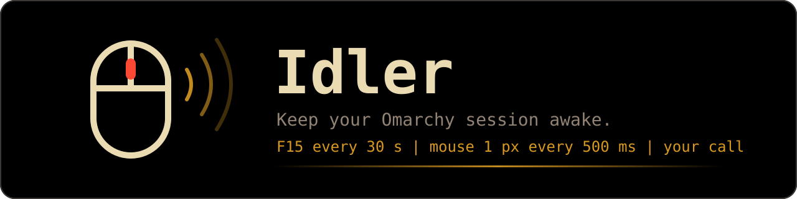
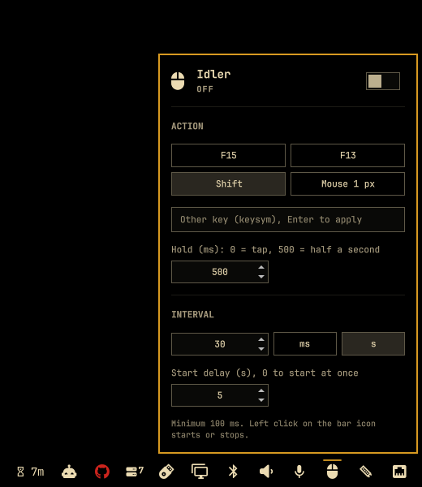

<p align="center">
  
</p>

<p align="center">
  <a href="https://github.com/azeroht/idler/actions/workflows/ci.yml"></a>
  <a href="https://github.com/azeroht/idler/releases"></a>
  <a href="LICENSE"></a>
</p>

**Idler** is an [Omarchy](https://omarchy.org) bar plugin that keeps your session looking busy. It
repeats a key press, or nudges the mouse one pixel right and back, at the interval you choose. Your
chat status stays green, remote desktops stay connected, and apps that nag about inactivity stay
quiet.

One click on the bar icon starts or stops it. A right click opens a native-looking panel to pick
the action and the interval.

## 📸 Screenshots

<p align="center">
  
</p>

| State              | Bar                                                         |
|--------------------|-------------------------------------------------------------|
| Running (red icon) |  |
| Stopped            |  |

## ✨ Features

- **One-click toggle** in the bar, with the active color while it runs and a tooltip such as
  `Idler: F15 every 30 s`.
- **Four presets**: `F15`, `F13`, `Shift`, or `Mouse 1 px`. F13 to F15 are bound to nothing in
  most apps, which makes them invisible pulses.
- **Any other key**: type a keysym (`Scroll_Lock`, `F20`, `space`...) and press Enter.
- **Tap or hold**: a key is tapped by default, or held down for up to 10 s on each pulse. For
  example `Shift` held `500` ms every 30 s shows as `Idler: Shift held 500 ms every 30 s`.
- **Start delay**: once switched on, wait up to an hour before the first pulse, for instance to
  leave the room or switch windows first.
- **Any interval**, from 100 ms to a day, in milliseconds or seconds.
- **Persistent**: the state survives shell restarts and reboots.
- **Multi-monitor aware**: every bar shows the same state, and only one of them sends the pulses.
- **Scriptable** through an IPC target, for keybindings or automation.
- **Safe by design**: no shell is ever interpreted, and keys are validated twice.

## 📦 Requirements

| Requirement                             | Why                                                        |
|-----------------------------------------|------------------------------------------------------------|
| Omarchy 4 with the Quickshell shell     | The plugin is an Omarchy shell bar widget                  |
| Hyprland 0.56 or newer (Lua config)     | The mouse nudge uses `hyprctl dispatch hl.dsp.cursor.move` |
| [`wtype`](https://github.com/atx/wtype) | Key presses go through the Wayland virtual keyboard        |

```bash
sudo pacman -S --needed wtype
```

## 🚀 Installation

```bash
omarchy plugin add https://github.com/azeroht/idler.git --enable
```

The icon lands in the right section of the bar. To put it somewhere else, for example right after
the microphone:

```bash
omarchy plugin enable azeroht.idler --after omarchy.microphone
```

To pin a reviewed version rather than following `main`, clone a tag into
`~/.config/omarchy/plugins/azeroht.idler`, then rescan the plugins:

```bash
git clone --branch v0.2.0 https://github.com/azeroht/idler.git ~/.config/omarchy/plugins/azeroht.idler
omarchy-shell shell rescanPlugins
omarchy plugin enable azeroht.idler
```

## 🗑️ Uninstall

Stop Idler first, so no pulse is left running, then remove the plugin and its state file:

```bash
omarchy-shell azeroht.idler stop
omarchy plugin remove azeroht.idler
rm -f ~/.local/state/azeroht-idler.json
```

`omarchy plugin remove` takes the widget out of the bar and deletes the plugin folder. Idler
writes nothing else: no configuration file of yours is touched. If you added a keybinding that
calls `omarchy-shell azeroht.idler`, remove it from `~/.config/hypr/bindings.lua` too.

## 🖱️ Usage

| Action                         | Result                                                 |
|--------------------------------|--------------------------------------------------------|
| Left click on the icon         | Start or stop                                          |
| Right click on the icon        | Open or close the settings panel                       |
| Hover the icon                 | Tooltip with the current action, or the pending delay  |
| Panel switch                   | Start or stop                                          |
| Panel preset button            | Repeat that action                                     |
| Panel "Other key" field, Enter | Repeat that keysym (letters, digits and `_` only)      |
| Panel hold field               | Hold time in ms, 0 for a tap, 500 for half a second    |
| Panel interval and unit        | Change the pace; anything under 100 ms is raised to it |
| Panel start delay field        | Wait that long, in s, after switching on (0 at once)   |
| Mouse wheel on a number field  | One step per notch, ten steps with Shift held          |

Every change applies at once and is saved in `~/.local/state/azeroht-idler.json`:

```json
{
  "enabled": true,
  "action": "F15",
  "interval": 30,
  "unit": "s",
  "hold": 0,
  "delay": 0
}
```

`action` is `mouse` or a keysym, `unit` is `ms` or `s`, `hold` is in milliseconds (0 to 10000,
ignored for the mouse and never longer than the interval), `delay` is in seconds (0 to 3600). An
invalid or unreadable file falls back to the defaults: F15 every 30 seconds, stopped.

## ⌨️ IPC

The plugin registers the `azeroht.idler` target, handy in Hyprland keybindings or scripts:

```bash
omarchy-shell azeroht.idler toggle   # start or stop
omarchy-shell azeroht.idler start
omarchy-shell azeroht.idler stop
omarchy-shell azeroht.idler open     # settings panel, on the focused monitor
omarchy-shell azeroht.idler close
omarchy-shell azeroht.idler status   # "F15 every 30 s", or "off"
```

For example, in `~/.config/hypr/bindings.lua`:

```lua
o.bind("SUPER + CTRL + I", "Toggle the idler", "omarchy-shell azeroht.idler toggle")
```

## ⚙️ How it works

| File                | Role                                                               |
|---------------------|--------------------------------------------------------------------|
| `BarWidget.qml`     | Bar icon, timer, state file, IPC target                            |
| `SettingsPanel.qml` | Settings popup built from the native Omarchy UI kit                |
| `Model.js`          | Pure logic: validation, defaults, interval maths, command building |
| `idler.sh`          | One pulse: a key tapped or held with `wtype`, or a 1 px nudge      |
| `manifest.json`     | Omarchy plugin manifest                                            |

- **Timing**: switching on starts the delay; when it runs out, the first pulse fires at once, then
  one follows every interval. Switching off during the delay cancels it.
- **Mouse nudge**: the cursor moves one pixel right, then 50 ms later one pixel left from wherever
  it is. If you move the mouse in between, your move is kept: the cursor never jumps back.
- **Several monitors**: each monitor has its own bar, hence its own widget instance. They all watch
  the state file, so they always agree, and only the instance on the first screen runs the timer.
- **Idle lock**: key presses come from a virtual keyboard. They keep apps and chat statuses active;
  whether they also postpone your idle lock depends on how your compositor and idle daemon count
  virtual input. To disable the lock, use Omarchy's own idle settings.

## 🔒 Security

- The keysym is checked in QML and again in `idler.sh`: letters, digits and `_` only, 32
  characters at most. It can never become an option or a command. The hold is checked the same
  way: digits only, 10000 at most.
- Commands run as argument lists (`Quickshell.execDetached`), never through a shell string.
- The cursor position read from Hyprland must be two integers before it is used.
- The plugin writes a single file, its state, and makes no network access.

## 🧪 Development

```bash
make test   # node --test (model and package) + shell tests of idler.sh with stubbed wtype and hyprctl
make lint   # bash -n, shellcheck (native or Docker), manifest JSON
```

The shell tests replace `wtype` and `hyprctl` with stubs, so they need neither Wayland nor
Hyprland. CI runs both targets on every push and pull request.

Releases follow [Semantic Versioning](https://semver.org): `vX.Y.Z-rc.N` pre-releases first, then
`vX.Y.Z`. See [CHANGELOG.md](CHANGELOG.md).

## 📄 License

[MIT](LICENSE)
